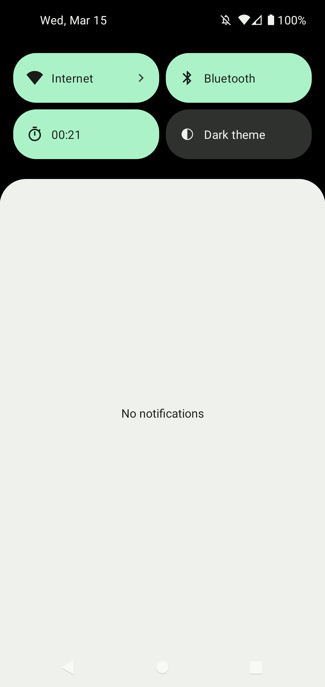

# Stopwatch Quick Tile

This Android app provides a stop watch as quick tile. There's no launcher icon, just the tile.

The notification is required for technical reasons. I recommend to mute notifications of this app.

## Maintenance notice

From my point of view this app is feature complete. I won't add new major features, but I will:
* Keep dependencies up-to-date
* Merge new translations
* Fix bugs

## Translations

App strings and the app store description can be translated via Crowdin: https://crowdin.com/project/stopwatch

## Credits

* Feature graphic by https://unsplash.com/de/@agebarros
